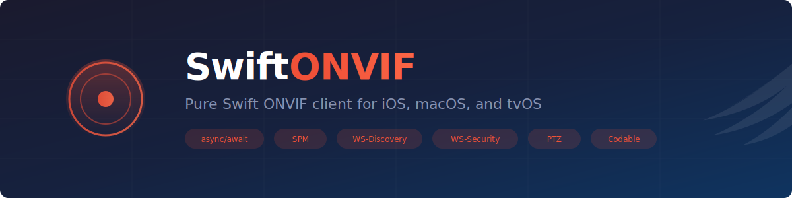

<p align="center">
  
</p>

<p align="center">
  <a href="https://swift.org"></a>
  <a href="https://developer.apple.com/macos/"></a>
  <a href="https://developer.apple.com/ios/"></a>
  <a href="https://developer.apple.com/tvos/"></a>
  <a href="https://www.swift.org/package-manager/"></a>
  <a href="LICENSE"></a>
</p>

<p align="center">
  <b>The first async/await-native, SPM-compatible ONVIF library for Swift.</b><br>
  Discover, control, and stream from IP cameras on Apple platforms.<br>
  No binary dependencies. No Objective-C bridging. No closed-source SOAP engines.
</p>

---

## Why SwiftONVIF?

There are ONVIF libraries for [Go](https://github.com/use-go/onvif), [Node.js](https://github.com/agsh/onvif), [Python](https://github.com/FalkTannworths/python-onvif-zeep), and [Rust](https://github.com/nickel-org/onvif-rs) -- but **nothing production-ready for Swift**. The highest-starred Swift ONVIF project has 97 stars, covers only 4 operations, and depends on a closed-source binary SOAP engine.

SwiftONVIF fills that gap with a clean, modern library built from scratch:

- **async/await** throughout -- no completion handlers, no Combine required
- **Sendable** and thread-safe by design
- **Codable** models with XMLCoder for type-safe SOAP marshalling
- **Network.framework** for WS-Discovery (no raw sockets)
- **CryptoKit** for WS-Security digest auth (no OpenSSL)

## Features

| Category | What You Get |
|----------|-------------|
| **Discovery** | Find cameras on the local network via WS-Discovery multicast |
| **Authentication** | WS-Security UsernameToken with SHA-1 digest (CryptoKit) |
| **Device Service** | Device information, capabilities, service discovery, clock sync |
| **Media Service** | Profiles, RTSP stream URIs, snapshot URIs, encoder configurations |
| **Media2 Service** | H.265 stream URIs and modern profile management |
| **PTZ Service** | Continuous/absolute/relative move, presets, status |
| **Imaging Service** | Brightness, contrast, saturation, sharpness |
| **Event Service** | PullPoint subscription for camera events *(planned)* |

## Installation

### Swift Package Manager

Add to your `Package.swift`:

```swift
dependencies: [
    .package(url: "https://github.com/oneshot2001/swift-onvif.git", from: "1.0.0")
]
```

Then add it to your target:

```swift
.target(
    name: "YourApp",
    dependencies: [
        .product(name: "SwiftONVIF", package: "swift-onvif")
    ]
)
```

### Requirements

| Platform | Minimum Version |
|----------|----------------|
| macOS | 13.0+ |
| iOS | 16.0+ |
| tvOS | 16.0+ |
| Swift | 5.9+ |

## Quick Start

### Discover Cameras on Your Network

```swift
import SwiftONVIF

let discovery = ONVIFDiscovery()
let devices = try await discovery.probe(timeout: .seconds(5))

for device in devices {
    print("\(device.name ?? "Unknown") at \(device.xAddrs)")
}
```

### Connect to a Camera

```swift
let camera = ONVIFCamera(
    host: "192.168.1.100",
    credential: ONVIFCredential(username: "admin", password: "pass")
)

// Device info
let info = try await camera.device.getDeviceInformation()
print("\(info.manufacturer) \(info.model) (fw: \(info.firmwareVersion))")

// Discover what services the camera supports
try await camera.initialize()
```

### Get Stream URIs

```swift
// Media profiles and RTSP stream
let profiles = try await camera.media.getProfiles()
let streamURI = try await camera.media.getStreamURI(profileToken: profiles[0].token)
print("RTSP: \(streamURI.uri)")
// -> rtsp://192.168.1.100:554/stream1

// JPEG snapshot
let snapshotURI = try await camera.media.getSnapshotURI(profileToken: profiles[0].token)
```

### PTZ Control

```swift
if let ptz = camera.ptz {
    // Pan right at half speed
    try await ptz.continuousMove(
        profileToken: profiles[0].token,
        velocity: PTZSpeed(panTilt: Vector2D(x: 0.5, y: 0.0))
    )

    // Stop
    try await ptz.stop(profileToken: profiles[0].token)

    // Jump to a saved preset
    let presets = try await ptz.getPresets(profileToken: profiles[0].token)
    try await ptz.gotoPreset(
        profileToken: profiles[0].token,
        presetToken: presets[0].token
    )
}
```

### Imaging Settings

```swift
if let imaging = camera.imaging {
    var settings = try await imaging.getImagingSettings(videoSourceToken: "video_source_1")
    settings.brightness = 60.0
    try await imaging.setImagingSettings(videoSourceToken: "video_source_1", settings: settings)
}
```

## Example CLI

The repo includes **ONVIFExplorer**, a command-line tool for testing:

```bash
# Discover cameras on the network
swift run ONVIFExplorer

# Query a specific camera
swift run ONVIFExplorer 192.168.1.100 admin password
```

## Supported ONVIF Operations

| Service | Operation | Status |
|---------|-----------|--------|
| Device | `GetDeviceInformation` | v0.1.0 |
| Device | `GetCapabilities` | v0.1.0 |
| Device | `GetServices` | v0.1.0 |
| Device | `GetSystemDateAndTime` | v0.1.0 |
| Media | `GetProfiles` | v0.2.0 |
| Media | `GetStreamUri` | v0.2.0 |
| Media | `GetSnapshotUri` | v0.2.0 |
| Media | `GetVideoEncoderConfigurations` | v0.2.0 |
| Media2 | `GetProfiles` (ver20) | v0.4.0 |
| Media2 | `GetStreamUri` (ver20, H.265) | v0.4.0 |
| PTZ | `ContinuousMove` / `Stop` | v0.3.0 |
| PTZ | `AbsoluteMove` / `RelativeMove` | v0.3.0 |
| PTZ | `GetPresets` / `GotoPreset` / `SetPreset` | v0.3.0 |
| PTZ | `GetStatus` | v0.3.0 |
| Imaging | `GetImagingSettings` / `SetImagingSettings` | v0.4.0 |
| Imaging | `GetOptions` | v0.4.0 |
| Event | `CreatePullPointSubscription` | v1.1.0 |
| Event | `PullMessages` | v1.1.0 |

## Architecture

```
Sources/SwiftONVIF/
├── Discovery/          WS-Discovery multicast via Network.framework
├── Auth/               WS-Security UsernameToken via CryptoKit
├── SOAP/               SOAP 1.2 envelope builder + HTTP client via XMLCoder
├── Services/
│   ├── DeviceService   Device info, capabilities, service discovery
│   ├── MediaService    Profiles, stream URIs, snapshots, encoders
│   ├── Media2Service   H.265 support, modern profile management
│   ├── PTZService      Pan/tilt/zoom control with presets
│   ├── ImagingService  Image settings (brightness, contrast, etc.)
│   └── EventService    PullPoint event subscription
├── Models/             Codable data structures for all ONVIF types
└── ONVIFCamera.swift   High-level convenience API and entry point
```

### Dependencies

| Dependency | Purpose |
|-----------|---------|
| [XMLCoder](https://github.com/CoreOffice/XMLCoder) | Type-safe XML encoding/decoding for SOAP |
| Foundation | HTTP networking (URLSession) |
| Network | WS-Discovery UDP multicast |
| CryptoKit | WS-Security SHA-1 digest authentication |

## Contributing

Contributions are welcome! See [CONTRIBUTING.md](CONTRIBUTING.md) for guidelines.

Whether it's adding support for a new ONVIF operation, testing against a camera model we haven't tried, or improving documentation -- every contribution helps build the Swift camera ecosystem.

## License

MIT License. See [LICENSE](LICENSE) for details.

## Author

**Matthew Visher** -- [@oneshot2001](https://github.com/oneshot2001)

---

<p align="center">
  <sub>Built for the Swift camera ecosystem. If this library is useful to you, a star helps others find it.</sub>
</p>
